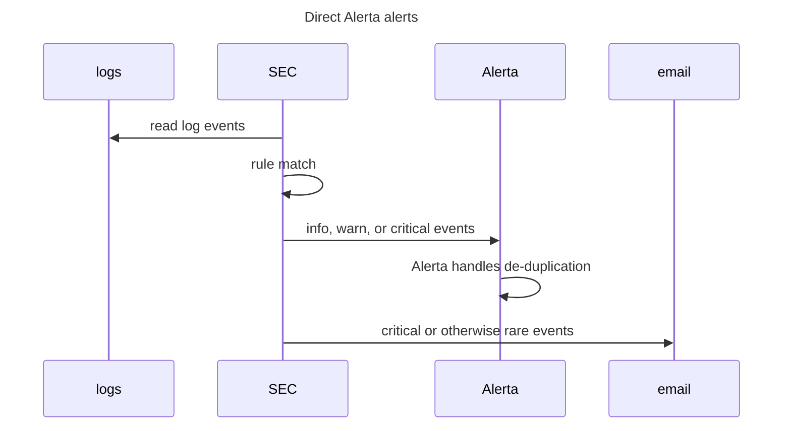
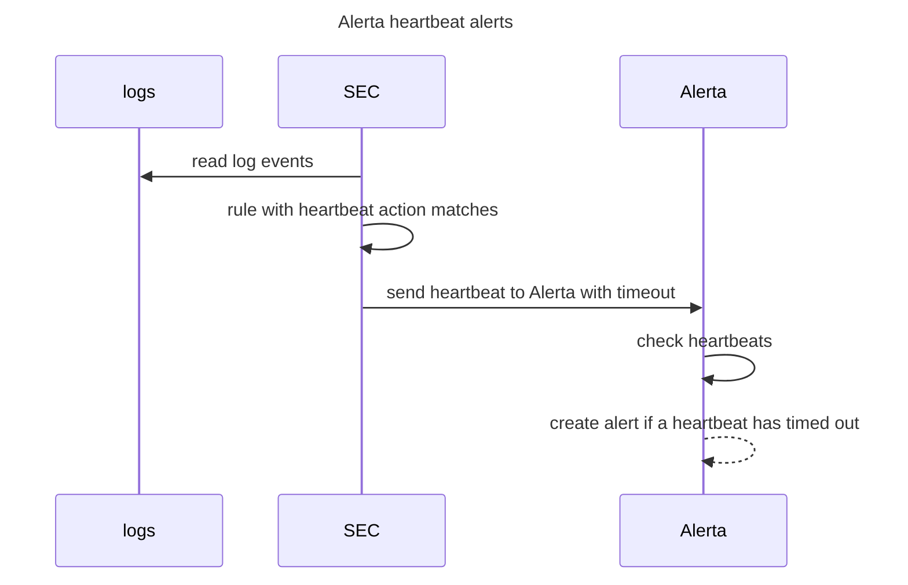

{:toc}

From time to time, I get inspiration to tinker with monitoring my home network. Sometimes I want to test some new features in an existing solution or some new technology. Usually, it ends with some corporate-level setup that is nice for a while, but eventually, I don't have time or interest to manage all that in my free time. Recently I have tried to implement an approach that is a bit better suited for home lab tinkering. This post is not a detailed step-by-step guide to do what I do, but more like an overview of my setup.

The environment that I'm monitoring looks somewhats like this:


I can collect logs from the firewall, homelab servers, other desktops/laptops than work-related ones, and from a few other devices. If some smart TV offers some logging, then sure, but usually no.

The firewall is one quite obvious item to monitor closely. Servers in the homelab network are not such a high-level target. Yes, I want to monitor those for SSH logins and such. However, when someone takes SSH or other connections there, things have already gone pretty south as there are no services exposed to the internet and only limited exposure to other VLANs.

With the home office network, I can only do network-level monitoring, but devices in that network should anyways be in Zero Trust level and monitored by someone else.


## Architecture

The main building blocks are the following..

* [Rsyslog](https://www.rsyslog.com/): event forwarding in log sources
* [Logstash](https://www.elastic.co/logstash): centralized log server
* [**Simple Event Correlator (SEC)**](https://simple-evcorr.github.io/): event correlation.
* [**Alerta**](https://alerta.io/): monitoring

.. and the overall architecture will be something like this:


## Deployment

I will show an overview of the deployment and will briefly explain the configurations I have.

### Logstash (Syslog server)

*  Logstash installation: [https://www.elastic.co/guide/en/logstash/current/installing-logstash.html](https://www.elastic.co/guide/en/logstash/current/installing-logstash.html)
*  Configuration:
   - I'm going with a very minimal setup without any changes in `/etc/logstash/logstash.yml`.
   - In `/etc/logstash/jvm.options` I have set memory options `-Xms1g` and `-Xmx3g`, so the initial heap size is 1GB and maximum is 3GB.

The basic Logstash deployment concept includes one or more *inputs* to receive some log events, usually *filters* to parse those events and *outputs* to send or write the filtered events somewhere.

These configurations can be split into multiple files and eventually can be more structured with *pipelines*. I'm using a simple setup where *input*, *filter*, and *output* are in a single file.

* Content of `/etc/logstash/conf.d/logstash-syslog.conf`:

The input section specifies TCP and UDP listeners for syslog data.

```
input {
  tcp {
    port => 51444
    type => syslog
    tags => ['syslog']
  }
  udp {
    port => 51444
    type => syslog
    tags => ['syslog']
  }
}
```

The filtering section does some content parsing, but almost all is for potential future use. The only one used now is the "syslog_program" field that I use in the output section.

```
  
filter {
  if [type] == "syslog" {
    grok {
      match => {
         "message" => [ "%{SYSLOGTIMESTAMP:syslog_timestamp} %{DATA:syslog_program}(?:\[%{POSINT:syslog_pid}\])?: \[%{DATA}\] %{DATA:snort_event} \[Classification: %{DATA:snort_classification}\] \[Priority: %{NUMBER:snort_priority}\] \{%{DATA:snort_protocol}\} %{IP:snort_src_ip}:%{POSINT:snort_src_port} -> %{IP:snort_dest}:%{POSINT:snort_dest_port}",
         "%{SYSLOGTIMESTAMP:syslog_timestamp} %{SYSLOGHOST:syslog_hostname} %{DATA:syslog_program}(?:\[%{POSINT:syslog_pid}\])?: /usr/bin/rsnapshot( -v)? %{DATA:rsnapshot_event}: %{GREEDYDATA:rsnapshot_output}",
         "%{SYSLOGTIMESTAMP:syslog_timestamp} %{SYSLOGHOST:syslog_hostname} %{DATA:syslog_program}(?:\[%{POSINT:syslog_pid}\])?: %{GREEDYDATA:syslog_message}",
         "%{TIMESTAMP_ISO8601:syslog_timestamp} %{SYSLOGHOST:syslog_hostname} %{DATA:syslog_program}(?:\[%{POSINT:syslog_pid}\])?: %{GREEDYDATA:syslog_message}",
         "%{SYSLOGTIMESTAMP:syslog_timestamp} %{DATA:syslog_program}(?:\[%{POSINT:syslog_pid}\])?: %{GREEDYDATA:syslog_message}"]
      }
      add_field => [ "received_at", "%{@timestamp}" ]
      add_field => [ "received_from", "%{host}" ]
    }
  }
  if [rsnapshot_event]{
      mutate {
         add_tag => [ "rsnapshot" ]
       }
  }
  if [snort_event]{
      mutate {
         add_tag => [ "snort" ]
       }
  }
}

```

The output section, in this case, specifies the output file. The previously mentioned `syslog_program` variable and the `host` variable will construct the output log file.

You may notice that `if` statements in `output` and `filter` sections are pretty useless as I only have one input that sets the `syslog` tag. Those `if` statements are mostly specified because of habit to do this when Logstash configuration is far more complex, but also it gives a sort of pre-defined structure in a case I want to expand the configuration with some other tag based filtering or outputs.

```
output {
  if "syslog" in [tags] {
      file {
         path => "/srv/logstash/%{host}-%{syslog_program}.log"
      }
  }
}
```

Note that the directory path in `path =>` needs to exist beforehand and it needs to have permissions which allows the `logstash` service user to create files into it. For example: `sudo mkdir /srv/logstash/ && sudo chown logstash /srv/logstash/ && sudo chmod 750 /srv/logstash/`.

### Log sources

Log sources will have just a basic rsyslog forwarding setup. In case you are more familiar with ELK stack installations, you may be wondering why I'm not using beats agents. For now,  I want this setup to work even if I would have just a regular rsyslog server that replaces Logstash. Logstash is currently only providing an easy possibility to expand the installation if I feel like I have a reason and time to do that at some point.

In rsyslog configurations of log sources I have basically just added a line `*.*  @@<logstash server>:51444` to `/etc/rsyslog.conf`. This forwards everything to Logstash using TCP. 

### Alerta

* Alerta installation: [https://docs.alerta.io/en/latest/quick-start.html](https://docs.alerta.io/en/latest/quick-start.html)

I'm running Alerta behind Nginx (Nginx -> uwsgi -> Alerta). You can find full deployment tutorial [here](https://docs.alerta.io/en/latest/gettingstarted/tutorial-1-deploy-alerta.html).

Here's my location configuration for the Nginx site:
```
        location /api { try_files $uri @api; }
        location @api {
            include uwsgi_params;
            uwsgi_pass unix:/run/uwsgi/uwsgi.sock;
            proxy_set_header Host $host:$server_port;
            proxy_set_header X-Real-IP $remote_addr;
            proxy_set_header X-Forwarded-For $proxy_add_x_forwarded_for;
        }

        location / {
                root /var/www/html;
                try_files $uri $uri/ /index.html;
        }
```

`uwsgi.ini` configuration:

```
[uwsgi]
chdir = /var/www
mount = /api=wsgi.py
callable = app
manage-script-name = true
env = BASE_URL=/api

master = true
processes = 5
logger = syslog:alertad

socket = /run/uwsgi/uwsgi.sock
chmod-socket = 664
uid = www-data
gid = www-data
vacuum = true

die-on-term = true
```

Content of `wsgi.py`:

```
from alerta import create_app
app = create_app()
```

Systemd service that is running the uwsgi service looks like this:

```
[Unit]
Description=uWSGI service

[Service]
ExecStartPre=/bin/bash -c 'mkdir -p /run/uwsgi; chown www-data:www-data /run/uwsgi'
ExecStart=/usr/local/bin/uwsgi --ini /etc/uwsgi.ini

[Install]
WantedBy=multi-user.target
```

The documentation for Alerta server configuration can be found here: [https://docs.alerta.io/en/latest/configuration.html](https://docs.alerta.io/en/latest/configuration.html).

### Simple Event Correlator

> SEC is an event correlation tool for advanced event processing which can be harnessed for event log monitoring, for network and security management, for fraud detection, and for any other task which involves event correlation.  
> -- https://simple-evcorr.github.io/

I'm using quite simple SEC rules to catch some patterns and do actions based on them. SEC can, however, do far more powerful event correlation. See its [man page](https://simple-evcorr.github.io/man.html) for more information.


#### Usage example

Here's a really simple SEC usage example:

1. Create a file `/tmp/rules.conf` with the following content:
```ini
type=SingleWithThreshold
ptype=RegExp
pattern=^Hello from (.*)$
desc=Listen for triple hello inside 5 seconds
action=write - Triple hello! First one was $1
window=5
thresh=3
```
  The action is launched when three events matching the pattern appear inside 5 seconds.

2. Launch SEC: `/opt/sec/sec --conf /tmp/rules.conf --input=/tmp/input.txt --reopen-timeout=5`
3. Launch command `for i in $(seq 1 3);do echo Hello from console$i;done >> /tmp/input.txt` in a different terminal
4. You should see this in SEC's output:
```
Triple hello! First one was console1
```

SEC's man page has a bit more practical example which would monitor for failed SSH attempts. In this example you can also see more practical action:

```ini
type=SingleWithThreshold
ptype=RegExp
pattern=sshd\[\d+\]: Failed .+ for (\S+) from [\d.]+ port \d+ ssh2
desc=Three SSH login failures within 1m for user $1
action=pipe '%s' /bin/mail -s 'SSH login alert' root@localhost
window=60
thresh=3 
```

#### Dynamic input files

In the previous usage example the input file was specified directly as a command line parameter. This is fine when you know and can specify all the files that should be monitored, but this wasn't quite enough for my use-case.

The issue I had was that I wanted new hosts to be automatically monitored without manually updating SEC's input files. Now, as my Logstash configuration creates files `%{host}-%{syslog_program}.log` I would need to know host-names that my future machines may have, or I would need to update input files for SEC when I add new hosts. Note that specifying something like `--input=/srv/logstash/*-sshd.log` does shell expansion and it will only include files that already exist, so it doesn't help even with SEC's reloading options.

The question 24 in SEC's [FAQ](https://simple-evcorr.github.io/FAQ.html#24) gave me a starting point to solve this. It shows how to handle timestamps in filenames, but I can leverage the same solution.

Below are sections from my SEC rules that provide this solution.
The first section of the configuration launches an external script `logtracker.py` when SEC is started. The script takes log file patterns as an input and string "WILD" presents wildcard (`*`) character in the patterns. 

```ini
type=Single
ptype=RegExp
pattern=^(?:SEC_STARTUP|SEC_RESTART)$
context=SEC_INTERNAL_EVENT
desc=start log file tracker
action=cspawn LOGTRACKER /usr/local/bin/logtracker.py /srv/logstash/WILDsshd.log /srv/logstash/WILDsudo.log

type=Single
ptype=RegExp
pattern=^Open file (.+) (0|-)$
context=LOGTRACKER
desc=open logfile $1 and start reading from offset $2
action=addinput $1 $2
```

What this does is that the script will take those patterns and constantly keeps checking for new log files (1st rule) and returns found file paths back to the SEC which will then add those to input files (2nd rule).


This is the source of the `logtracker.py` script:

```py
#!/usr/bin/python3

import sys
import glob
import time

files = []
for arg in sys.argv[1:]:
    files += glob.glob(arg.replace('WILD', '*'))
for f in files:
    print("Open file {} -".format(f), flush=True)
try:
    while True:
        files2 = []
        for arg in sys.argv[1:]:
            files2 += glob.glob(arg.replace('WILD', '*'))
        for f in files2:
            if f not in files:
                print("Open file {} 0".format(f), flush=True)
                files.append(f)
        time.sleep(1)
except KeyboardInterrupt:
    sys.exit(0)
```

Now I can add new hosts, configure rsyslog forwarding, and SEC will automatically pick-up log files of those hosts as well.

#### SEC ruleset

The below diagrams show two basic flows that I try to achieve with my SEC ruleset. 

The first flow includes direct alerts that SEC creates based on matching rules. 



The second flow SEC sends Alerta hearbeat messages when a certain rule matches.  The heartbeats will not cause an alert as long as a new heartbeat is sent before the specified timeout.



I try to keep the number of email alerts as low as possible because it quickly turns into a noise that one just ignores. Some rules may not seem like it, for example, emailing due to a successful or failed login in Pfsense web UI.  However, I have to log in to the web UI rarely, so it doesn't yet cause constant noise, and failed login is really rare due to a password management system where I don't have to type my password.

Below is the current ruleset that I have. Some form of action is launched from the following events.

* SSH logins (failed/successful)
* sudo logins (failed/successful)
* sshguard's attack alerts (Pfsense)
* Web UI logins (Pfsense) (failed/successful)
* Delay in Rsnapshot backups (uses Alerta [heartbeats](https://docs.alerta.io/en/latest/gettingstarted/tutorial-2-housekeeping.html#step-3-heartbeats))

The content is a Jinja template and there is some Jinja variable definitions.

* `{{ log_dir }}` -> `/srv/logstash`
* `{{ alerta_api_address }}` -> `http://127.0.0.1/api`
* `{{ sec_email.from }}` -> Sender address for email alerts
* `{{ sec_email.to }}` -> Destination address for email alerts
* `{{ sec_email.server }}` -> My SMTP server
* `{{ sec_email.port }}` -> SMTP port

The ruleset is just a starting point that I'm trying to improve with time. The SEC project has a [ruleset repository](https://github.com/simple-evcorr/rulesets/blob/master/ssh.sec), but instead of just using some existing rules, I try to be quite selective in this as well.

```ini
# First two rules monitor for new files

type=Single
ptype=RegExp
pattern=^(?:SEC_STARTUP|SEC_RESTART)$
context=SEC_INTERNAL_EVENT
desc=start log file tracker
action=cspawn LOGTRACKER /usr/local/bin/logtracker.py {{ log_dir }}/WILDrsnapshot.log {{ log_dir }}/WILDsshd.log {{ log_dir }}/WILDsudo.log {{ log_dir }}/WILDphp-fpm.log {{ log_dir }}/WILD-sshguard.log

type=Single
ptype=RegExp
pattern=^Open file (.+) (0|-)$
context=LOGTRACKER
desc=open logfile $1 and start reading from offset $2
action=addinput $1 $2

###########################################
# SSH/sudo sessions and other common stuff #
###########################################

type=Single
ptype=RegExp
pattern=\d ([0-9A-Za-z]+) sudo:.*authentication failure.*user=([0-9A-Za-z]+)
desc=sudo auth failures
action=shellcmd  alerta --endpoint-url "{{ alerta_api_address }}" send --service sudo --resource "$1" --environment Homelab --event "sudo authentication failure by $2 in host $1" --correlate SEC --severity warning --text \'$0\'

type=Single
ptype=RegExp
pattern=\d ([0-9A-Za-z]+) sshd\[\d+\]:.*authentication failure.*rhost=([0-9]+\.[0-9]+\.[0-9]+\.[0-9]+).*user=([0-9A-Za-z]+)
desc=ssh auth failure
action=shellcmd  alerta --endpoint-url "{{ alerta_api_address }}" send --service sshd --resource "$1" --environment Homelab --event "ssh login failure in $1 from $2 by $3" --correlate SEC --severity warning --text \'$0\'; \
       shellcmd /usr/local/bin/send_email.py "{{ sec_email.from }}" "{{ sec_email.to }}" "ssh login failure in $1" "ssh login failure in $1 from $2 by $3" "{{ sec_email.server }}" {{ sec_email.port }}

type=Single
ptype=RegExp
pattern=\d ([0-9A-Za-z]+) sshd\[\d+\]: Failed password for invalid user ([0-9A-Za-z]+) from ([0-9]+\.[0-9]+\.[0-9]+\.[0-9]+)
desc=ssh invalid user
action=shellcmd  alerta --endpoint-url "{{ alerta_api_address }}" send --service sshd --resource "$1" --environment Homelab --event "ssh login failure in $1 with invalid user $2 from $3" --correlate SEC --severity warning --text \'$0\'; \
      shellcmd /usr/local/bin/send_email.py "{{ sec_email.from }}" "{{ sec_email.to }}" "ssh login failure in $1 with invalid user" "ssh login failure in $1 with invalid user $2 from $3" "{{ sec_email.server }}" {{ sec_email.port }}

type=Single
ptype=RegExp
pattern=login\[.*\]: FAILED LOGIN.*
desc=TTY failed login
action=shellcmd  alerta --endpoint-url "{{ alerta_api_address }}" send --service TTYlogin --resource "{{ inventory_hostname }}" --environment Homelab --event "TTY login failure" --correlate SEC --severity warning --text \'$0\'

type=Single
ptype=RegExp
pattern=\d ([A-Za-z0-9._-]+) (sshd|sudo)(?:\[\d+\])?: pam_unix\((?:sshd|sudo):session\): session (opened|closed) for user ([0-9A-Za-z]+)
desc=sudo session
action=shellcmd  alerta --endpoint-url "{{ alerta_api_address }}" send --service "$2" --resource "$1" --environment Homelab --event "$2 session $3 for user $4 in host $1" --correlate SEC --severity information --text \'$0\'

type=Single
ptype=RegExp
pattern=\d ([0-9A-Za-z]+) sshd\[\d+\]: Accepted (publickey|password|keyboard-interactive\/pam) for ([A-z0-9_-]+) from ([0-9.]+) port [0-9]+
desc=ssh accepted pass or pub key
action=shellcmd  alerta --endpoint-url "{{ alerta_api_address }}" send --service sshd --resource "$1" --environment Homelab --event "Accepted $2 for user $3 in host $1 from $4" --correlate SEC --severity information --text \'$0\'

###########
# pfsense #
###########

type=SingleWithThreshold
ptype=RegExp
pattern=webConfigurator authentication error for user '([a-zA-Z0-9@.-]+)' from: ([0-9]+\.[0-9]+\.[0-9]+\.[0-9]+).*
desc=Pfsense failed web ui login
window=120
thresh=2
action=shellcmd  alerta --endpoint-url "{{ alerta_api_address }}" send --service "pfsense" --resource "pfsense" --environment Homenet --event "Failed login in Pfsense Web UI for user '$1' from '$2'" --correlate SEC --severity critical --text \'$0\'; \
       shellcmd /usr/local/bin/send_email.py "{{ sec_email.from }}" "{{ sec_email.to }}" "Failed login in Pfsense Web UI" "Failed login in Pfsense Web UI for user $1 from $2" "{{ sec_email.server }}" {{ sec_email.port }}

type=Single
ptype=RegExp
pattern=/index.php: Successful login for user '([a-zA-Z0-9@.-]+)' from: ([0-9]+\.[0-9]+\.[0-9]+\.[0-9]+).*
desc=Pfsense successful web ui login
action=shellcmd  alerta --endpoint-url "{{ alerta_api_address }}" send --service "pfsense" --resource "pfsense" --environment Homenet --event "Successful login in Pfsense Web UI for user '$1' from '$2'" --correlate SEC --severity warning --text \'$0\'; \
      shellcmd /usr/local/bin/send_email.py "{{ sec_email.from }}" "{{ sec_email.to }}" "Successful login in Pfsense Web UI" "Successful login in Pfsense Web UI for user $1 from $2" "{{ sec_email.server }}" {{ sec_email.port }}

type=Single
ptype=RegExp
pattern=sshguard\[\d+\]: Attack from \\"([0-9]+\.[0-9]+\.[0-9]+\.[0-9]+)\\" on service ([A-Za-z]+\s?[A-Za-z]+?) with danger (\d+)
desc=Pfsense sshguard attack detected
action=shellcmd  alerta --endpoint-url "{{ alerta_api_address }}" send --service sshguard --resource "pfsense" --environment Homenet --event "Pfsense - attack from $1 on service $2" --correlate SEC --severity critical --text \'$0\'; \
       shellcmd /usr/local/bin/send_email.py "{{ sec_email.from }}" "{{ sec_email.to }}" "Pfsense's sshguard detected an attack" "Attack from $1 on service $2 with danger $3" "{{ sec_email.server }}" {{ sec_email.port }}

# matches with pfsense's syslog format where hostname is omitted
# these will not scale well, for example, if multiple pfsense boxes
# https://bugs.freebsd.org/bugzilla/show_bug.cgi?id=194231
type=Single
ptype=RegExp
pattern=\d sshd\[\d+\]: Accepted (publickey|password|keyboard-interactive\/pam) for ([A-z0-9_-]+) from ([0-9.]+) port [0-9]+
desc=ssh accepted pass or pub key
action=shellcmd  alerta --endpoint-url "{{ alerta_api_address }}" send --service sshd --resource "pfsense" --environment Homelab --event "Accepted $1 for user $2 in Pfsense from $3" --correlate SEC --severity warning --text \'$0\'
# secerity warning because ssh to pfsense are rare

type=Single
ptype=RegExp
pattern=\d sshd\[\d+\]: error: PAM: Authentication error for ([A-z0-9_-]+) from ([0-9.]+)
desc=ssh failed login
action=shellcmd  alerta --endpoint-url "{{ alerta_api_address }}" send --service sshd --resource "pfsense" --environment Homelab --event "Authentication error for user $1 in Pfsense from $2" --correlate SEC --severity warning --text \'$0\'


#####################
# Alerta heartbeats #
#####################

# Backups
# Action creates heartbeats to alerta
type=Single
ptype=RegExp
pattern=\d ([A-Za-z0-9._-]+) rsnapshot(?:\[\d+\])?: \/usr\/bin\/rsnapshot(?:\s-v)? hourly: completed successfully
desc=rsnapshot backups
action=shellcmd /usr/local/bin/alerta --endpoint-url "{{ alerta_api_address }}" heartbeat --origin $1_backup --timeout 86400 -E Homelab --severity critical
# alerta creates critical alert if it doesn't receive a new heartbeat within the timeout
```

All pattern matches generate some form of an event to Alerta using alerta cli tool. The basic syntax for this is:

```bash
alerta --endpoint-url "<alerta_api_address>" send --service <service name> --resource <resource name> --environment <env name> --event <event description> --correlate <some value for simple correlation> --severity <severity level> --text <more detailed description>
```

Note that the `environment` and the `severity` needs to match options that are configured in Alerta's configuration.

Some events that I expect to happen rarely generate an additional email alert. I have an SMTP relay server in my "homelab" network and I use a small Python script to send emails from SEC:

```python
#!/usr/bin/python3

"""
usage:

./send_email.py "<from>" "<to>" "<subject>" "<body>" "<smtp server>" <port>
"""

import smtplib
import argparse

def send(from_, to_, subject, text, server, port):
    mailserver = smtplib.SMTP(server, 25)
    mailserver.ehlo()
    message = 'Subject: {}\n\n{}'.format(subject, text)
    mailserver.sendmail(from_, to_, message)
    mailserver.quit()


if __name__ == '__main__':
    args = argparse.ArgumentParser()
    args.add_argument('From')
    args.add_argument('To')
    args.add_argument('Subject')
    args.add_argument('Body')
    args.add_argument('Server')
    args.add_argument('Port', default=25, type=int)
    res = args.parse_args()
    send(res.From, res.To, res.Subject, res.Body, res.Server, res.Port)
```

#### Run as Systemd service

This is the systemd unit file which I use to run the SEC:

```ini
[Unit]
Description=Simple Event Correlator service
After=network.target

[Service]
Type=simple
User=logstash
Environment="LC_ALL=en_US.UTF-8"
Environment="LANG=en_US.UTF-8"
ExecStart=/usr/bin/perl /opt/sec/sec --conf /opt/sec/rules/common-rules.conf --intevents --intcontexts --debug=6
Restart=on-failure
RestartSec=10s

[Install]
WantedBy=multi-user.target
```

Note that the service is running as `logstash` user so this user needs to have proper access to files under `/opt/sec/`.

## Security considerations

I didn't mention anything about authentication or other security features in the used components  because I have not yet implemented those while testing the setup, but I wanted to mention a few security configurations that I will implement in one form or another.

### Alerta authentication and HTTPS

Alerta supports multiple different authentication schemes. You can find list of those here: [https://docs.alerta.io/en/latest/authentication.html#authentication](https://docs.alerta.io/en/latest/authentication.html#authentication). 

You need to provide an Alerta API key for the SEC service when you enable authentication in Alerta. With the alerta cli tool this can be done by specifying environment variable in SEC service's systemd unit file:

```
Environment="ALERTA_API_KEY=<api key>"
```

However, keep in mind that all users can read the contents of the unit file using Dbus interface (`systemctl show`).

Setting up HTTPS in reverse proxy like, Nginx or Apache, does not require any additional configuration in Alerta. You can find some Nginx configuration examples [here](https://mtask.github.io/2020/04/18/nginx-client-certs.html) and also in [this](https://ssl-config.mozilla.org/) excellent tool provided by Mozilla.

### Logstash inputs and TLS

Here's an example `input` with TLS enabled:

```
  tcp {
    port => 51445
    mode => "server"
    type => syslog
    ssl_enable => true
    ssl_certificate_authorities => "/etc/logstash/tls/cacert.pem"
    ssl_cert => "/etc/logstash/tls/logstashcrt.pem"
    ssl_key => "/etc/logstash/tls/logstashkey.pem"
    ssl_verify => false # this is for client certificate
    tags => ['syslog']
  }
```

Setup message forwarding over TLS in rsyslog configurations:

```
...
# CA certificate
global(DefaultNetstreamDriverCAFile="/etc/cacert.pem")
...
# Forward all events
action(type="omfwd" protocol="tcp" port="51445" target="<LOGSTASH HOST>"
       StreamDriver="gtls" StreamDriverMode="1" StreamDriverAuthMode="anon")
...
```

Ensure that you have `rsyslog-gnutls` package installed on your log sources.


If you want to require client certificate then set `ssl_verify` to `true` in Logstash configuration and set client certificate in rsyslog configuration like this:

```
global(
DefaultNetstreamDriverCAFile="/etc/cacert.pem"
DefaultNetstreamDriverCertFile="/path/to/CLIENT-cert.pem"
DefaultNetstreamDriverKeyFile="/path/to/CLIENT-key.pem"
)
```

## Log files lifecycle

The actual log rotation configuration is TBD, but I will be using something simple like the below configuration. In the below example, when a file size grows to 20M, it will be rotated and moved to the history sub-directory.

`/etc/logrotate.d/logstash`:

```
/srv/logstash/*.log {
        copytruncate
        size 20M
        olddir /srv/logstash/history
        rotate 20
    missingok
    notifempty
}
```

## How it all looks

The most visual thing to show is Alerta, and this is how it looks with some events.


You can notice the duplicate column and how multiple logins and such will not clutter the output. The coloring also helps nicely to spot events with different severity levels. The next steps will be to implement the SEC ruleset for Snort and  OpenVPN, which I will cover in another post.