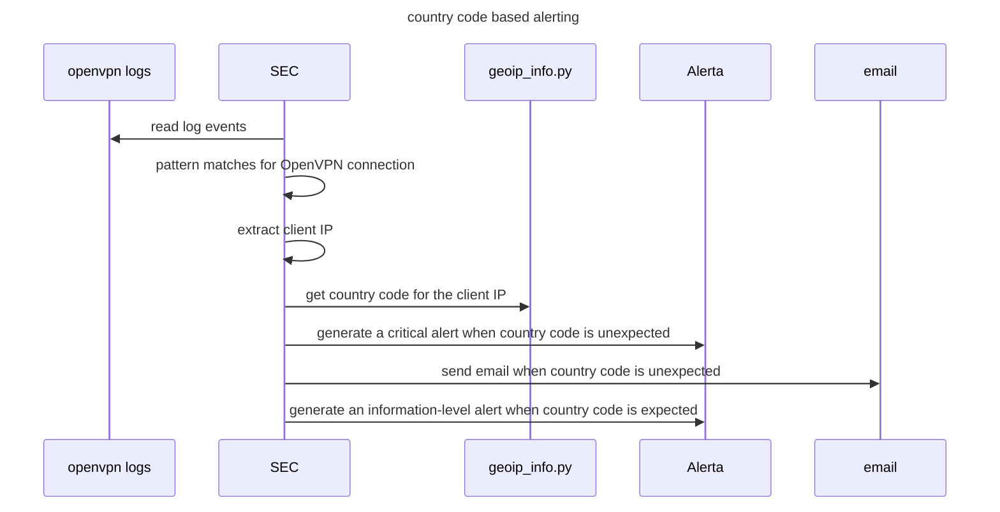

{:toc}

This post continues with the monitoring setup introduced in the [part one](https://mtask.github.io/2021/01/03/centralized-log-collection-and-SEC-in-home-network.html) of this post series. I'll be adding some geolocation based Simple Event Correlator (SEC) rules for OpenVPN.

## Initial setup

The starting point will be the same architecture I deployed during the previous post.


Now I only need to add some SEC rules to monitor VPN connections.

## OpenVPN - monitoring flow

The main monitoring flow I want to add for OpenVPN is shown in the below diagram.


The `geoip_info.py`script is a helper tool to check country code for an IP address with SEC. 

```python
#!/usr/bin/python3

import geoip2.database
# pip3 install geoip2
import sys

# sys.argv[1] --> Event
# sys.argv[2] --> IP

if len(sys.argv) != 3:
    sys.exit("geoip_info.py <event> <ip>")

with geoip2.database.Reader('/opt/geo/GeoLite2-Country.mmdb') as reader:
    try:
       response = reader.country(sys.argv[2])
    except geoip2.errors.AddressNotFoundError:
       sys.exit("address not found")
print("{event}:{ip}:{country_code}".format(event=sys.argv[1], ip=sys.argv[2],country_code=response.country.iso_code))
```
The script takes two arguments. An event description and an IP address. The event descriptor is returned in output which can then be used  in SEC pattern matching. This way the script can be used with different type of events where getting the geolocation of an IP address is useful.

The intended use-case for the script is with SEC's `spawn` action. Spawn launches a given shell command and matches the returned standard output against its rules.

You may have noticed the `/opt/geo/GeoLite2-Country.mmdb` in the script. That is Maxmind's free country database for IP addresses and it can be downloaded from [here](https://dev.maxmind.com/geoip/geoip2/geolite2/) (requires sign-up).

## OpenVPN - SEC rules

The ruleset for catching new OpenVPN connections and doing some country code based correlation consists of three different rules:

1. Match a new connection from OpenVPN logs and use `spawn ` action to call `geoip_info.py "openvpn connection for user $2" $1`  where `$1` is the extracted username and `$2` is the extracted IP. This returns the following like string: `openvpn connection for user <username>:<ip>:<country code>`. The pattern  of the rule matches against this type of OpenVPN log lines:  `<29>Jan  6 17:26:44 openvpn[14231]: 1.2.3.4:24195 [user1] Peer Connection Initiated with [AF_INET]1.2.3.4:24195`.
2. Generate a critical level alert to Alerta if country code is not the expected code for VPN connections.
3. Generate an information level event to Alerta if country code is the expected code for VPN connections.

Patterns in the second and third rule match against the output of the `geoip_info.py` command.

```ini
###########
# OpenVPN #
###########

# rule 1
type=Single
ptype=RegExp
pattern=openvpn\[\d+\]: ([0-9.]+):(?:[\d]+) \[([A-z0-9_-]+)\] Peer Connection Initiated
desc=New OpenVPN connection
action=spawn /opt/geo/geoip_info.py "openvpn connection for user $2" $1

# rule 2
type=Single
ptype=RegExp
pattern=openvpn connection for user ([A-z0-9_-]+):([0-9.]+):((?!{{ sec.vpn.expected_country }}\b)\b[A-Z][A-Z])
desc=OpenVPN connection not from an expected country code
action=shellcmd  alerta --endpoint-url "{{ alerta_api_address }}" send --service sshd --resource "openvpn" --environment Homenet --event "OpenVPN connection for user $1 from IP $2 and country $3" --correlate SEC --severity critical --text "$0"; \
       shellcmd /usr/local/bin/send_email.py "{{ sec_email.from }}" "{{ sec_email.to }}" "Unexpected OpenVPN connection!" "OpenVPN connection for user $1 from IP $2 and country $3" "{{ sec_email.server }}" {{ sec_email.port }}

# rule 3
type=Single
ptype=RegExp
pattern=openvpn connection for user ([A-z0-9_-]+):([0-9.]+):{{ sec.vpn.expected_country }}
desc=OpenVPN connections from the expected country code
action=shellcmd  alerta --endpoint-url "{{ alerta_api_address }}" send --service sshd --resource "openvpn" --environment Homenet --event "OpenVPN connection for user $1 from IP $2 and country FI" --correlate SEC --severity information --text "$0"
```

 This is how the outcome looks in Alerta when there's a connection from the expected country.


There's not much more to it at this point. I might add more rules later when I have time to test and see log events from different type of failed events, but as this is a service exposed to the internet, there's not point to generate alert from every poke against it.