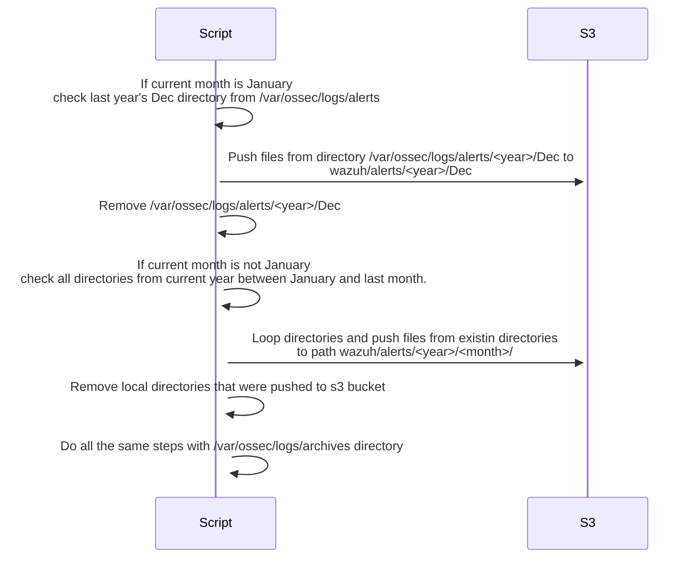

{:toc}

This post shows how to archive logs and alerts stored by Wazuh to s3 bucket. I've used a simple bash script and systemd timers for this. 
Wazuh stores all alerts by default in location `/var/ossec/logs/alerts`. It rotates all files daily to directory structure `/var/ossec/logs/alerts/<year>/<month>/`.
Same applies for `/var/ossec/logs/archives` where every received log event is stored if [archives feature](https://documentation.wazuh.com/current/user-manual/manager/wazuh-archives.html) is enabled.


Archiving script has the following logic.



In short, all other than current month's files are pushed to s3 and removed locally. This doesn't affect events in Wazuh indexer (Elastic/Kibana).

## Preparations

Wazuh server needs to have `s3cmd` installed and configured. Note that script uses `-e` switch which enables GPG encryption.


## Archiving script - walkthrough

I'll go through the different sections of the script. Whole script can be found at the end of this post.
Script pushes all logs to s3 for the current year when executed first time and **removes local copies**. If logs from previous years exist and needs to be archived then some modifications are needed.

* First some variable declarations. Only modification that is necessary is to set `BUCKET` variable. For example: `BUCKET=s3://abc`

```sh
#!/bin/bash

set -e

BUCKET="s3://<SET BUCKET HERE>"
WAZUH_ALERTS="/var/ossec/logs/alerts"
WAZUH_ARCHIVE="/var/ossec/logs/archives"

YEAR=$(date "+%Y")
```

* This part handles change of the year and pushes files from last year's Dec directories (alerts and archives) to s3.
  * If directory exists, files are pushed to s3 and local directory is removed.
```sh
if [[ $(date "+%m") = "01" ]]
then
    YEAR=$((YEAR-1))
    if [[ -d "$WAZUH_ALERTS/$YEAR/Dec/" ]]
    then
        s3cmd put "$WAZUH_ALERTS/$YEAR/Dec/"* "$BUCKET/wazuh/alerts/$YEAR/Dec/" -e
        rm -rf "$WAZUH_ALERTS/$YEAR/Dec/"
    else
        echo "Directory does not exist - $WAZUH_ALERTS/$YEAR/Dec/"
    fi
    if [[ -d "$WAZUH_ARCHIVE/$YEAR/Dec/" ]]
    then
        s3cmd put "$WAZUH_ARCHIVE/$YEAR/Dec/"* "$BUCKET/wazuh/archives/$YEAR/Dec/" -e
        rm -rf "$WAZUH_ARCHIVE/$YEAR/Dec/"
    else
        echo "Directory does not exist - $WAZUH_ARCHIVE/$YEAR/Dec/"
    fi
    exit
fi
```

* This part handles months between 1-11. It loops over `/var/ossec/logs/<alerts|archives>/<year>/<month>` directories from January to last month.
  * If directory exists, files are pushed to s3 and local directory is removed.

```sh
for m in $(seq 1 $(($(date "+%m")-1)))
do
    MONTH=$(date --date=$m" month" +'%b')
    if [[ -d "$WAZUH_ALERTS/$YEAR/$MONTH/" ]]
    then
        s3cmd put "$WAZUH_ALERTS/$YEAR/$MONTH/"* "$BUCKET/wazuh/alerts/$YEAR/$MONTH/" -e
        rm -rf "$WAZUH_ALERTS/$YEAR/$MONTH/"
    else
        echo "Directory does not exist - $WAZUH_ALERTS/$YEAR/$MONTH/"
    fi
    if [[ -d "$WAZUH_ARCHIVE/$YEAR/$MONTH/" ]]
    then
        s3cmd put "$WAZUH_ARCHIVE/$YEAR/$MONTH/"* "$BUCKET/wazuh/archives/$YEAR/$MONTH/" -e
        rm -rf "$WAZUH_ARCHIVE/$YEAR/$MONTH/"
    else
        echo "Directory does not exist - $WAZUH_ARCHIVE/$YEAR/$MONTH/"
    fi
done
```

## Systemd service and timer

* Save script to `/usr/bin/wazuh-s3-archive` and ensure it has exec bit set.
* Save the followin systemd service to `/etc/systemd/system/wazuh-s3-archive.service`.

```ini
[Unit]
Description=Archive wazuh alerts and archives to s3 bucket
Wants=wazuh-s3-archive.timer

[Service]
Type=oneshot
ExecStart=/usr/bin/wazuh-s3-archive

[Install]
WantedBy=multi-user.target
```

* Save the following systemd timer file to `/etc/systemd/system/wazuh-s3-archive.timer`.

```ini
[Unit]
Description=Archive wazuh alerts and archives to s3 bucket
Requires=wazuh-s3-archive.service

[Timer]
Unit=wazuh-s3-archive.service
OnCalendar=*-*-01 02:00:00

[Install]
WantedBy=timers.target
```

Modify `OnCalendar=` if needed, but script should be executed once a month for its logic to work properly.
Enable timer with command `sudo systemctl enable wazuh-s3-archive.timer`. Use command `sudo systemctl list-timers` to check that timer is enabled correctly.
You can test run the service with command `sudo systemctl start wazuh-s3-archive.service`. Check that there were no errors with `journalctl -u wazuh-s3-archive.service`.

## Archiving script


```sh
#!/bin/bash

set -e

WAZUH_ALERTS="/var/ossec/logs/alerts"
WAZUH_ARCHIVE="/var/ossec/logs/archives"

YEAR=$(date "+%Y")

# Handle December when current month is January
if [[ $(date "+%m") = "01" ]]
then
    YEAR=$((YEAR-1))
    if [[ -d "$WAZUH_ALERTS/$YEAR/Dec/" ]]
    then
        s3cmd put "$WAZUH_ALERTS/$YEAR/Dec/"* "$BUCKET/wazuh/alerts/$YEAR/Dec/" -e
        rm -rf "$WAZUH_ALERTS/$YEAR/Dec/"
    else
        echo "Directory does not exist - $WAZUH_ALERTS/$YEAR/Dec/"
    fi
    if [[ -d "$WAZUH_ARCHIVE/$YEAR/Dec/" ]]
    then
        s3cmd put "$WAZUH_ARCHIVE/$YEAR/Dec/"* "$BUCKET/wazuh/archives/$YEAR/Dec/" -e
        rm -rf "$WAZUH_ARCHIVE/$YEAR/Dec/"
    else
        echo "Directory does not exist - $WAZUH_ARCHIVE/$YEAR/Dec/"
    fi
    exit
fi

# Handle months 1 - 11
for m in $(seq 1 $(($(date "+%m")-1)))
do
    MONTH=$(date --date=$m" month" +'%b')
    if [[ -d "$WAZUH_ALERTS/$YEAR/$MONTH/" ]]
    then
        s3cmd put "$WAZUH_ALERTS/$YEAR/$MONTH/"* "$BUCKET/wazuh/alerts/$YEAR/$MONTH/" -e
        rm -rf "$WAZUH_ALERTS/$YEAR/$MONTH/"
    else
        echo "Directory does not exist - $WAZUH_ALERTS/$YEAR/$MONTH/"
    fi
    if [[ -d "$WAZUH_ARCHIVE/$YEAR/$MONTH/" ]]
    then
        s3cmd put "$WAZUH_ARCHIVE/$YEAR/$MONTH/"* "$BUCKET/wazuh/archives/$YEAR/$MONTH/" -e
        rm -rf "$WAZUH_ARCHIVE/$YEAR/$MONTH/"
    else
        echo "Directory does not exist - $WAZUH_ARCHIVE/$YEAR/$MONTH/"
    fi
done
```
